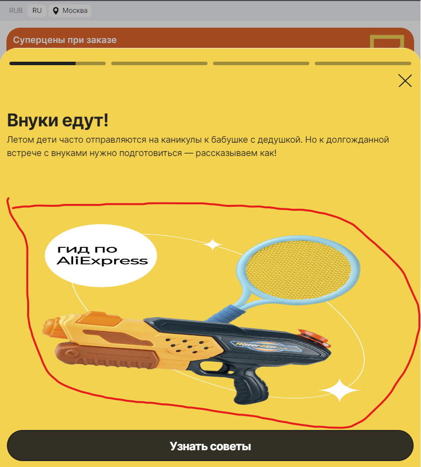

# Баг репорт

**Проект:** Aliexpress

**Раздел:** STORY

**Заголовок:**  Растянут контент статьи | Окно 767px x 830px

**ID:** EX_T-003-02

 **Приоритет:** Низкая

 **Серьезность:** Низкая

**Описание:**

**Окружение:**  

* Браузер: Яндекс v.23.5.3.904 (64-bit)
* OC: Windows 11 Pro 21H2 Сборка 22000.2057

**Шаги по воспроизведению:**

1. Перейти на страницу <https://aliexpress.ru>
2. Масштабировать окно браузера 767px x 830px
3. Клик на иконку статьи "Внуки едут"

**Фактический результат:**

* Изображение контента не масштабируется под окно браузера и выглядит растянутым

**Ожидаемый результат:**

* Изображение контента масштабируется под окно браузера

Приложение:

