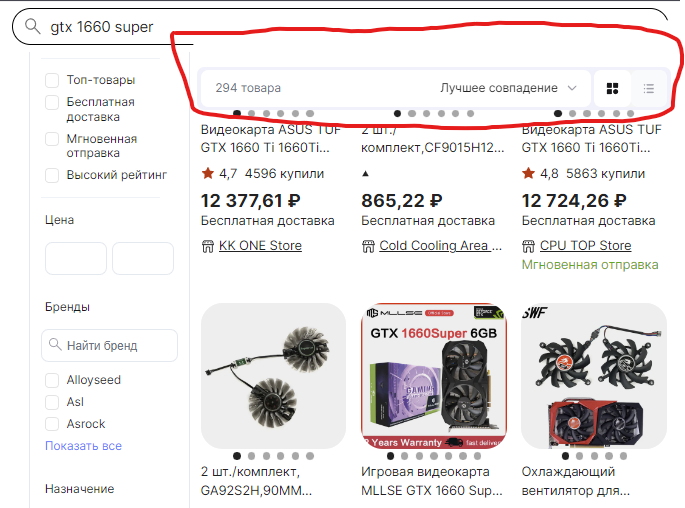

# Баг репорт

**Проект:** Aliexpress

**Раздел:** ПОИСК

**Заголовок:**  Наложение контента на поле поиска | Окно 766px x 830px

**ID:** EX_T-003-08

 **Приоритет:** Низкая

 **Серьезность:** Низкая

**Описание:**

**Окружение:**  

* Браузер: Яндекс v.23.5.3.904 (64-bit)
* OC: Windows 11 Pro 21H2 Сборка 22000.2057

**Шаги по воспроизведению:**

1. Перейти на страницу <https://aliexpress.ru/wholesale?SearchText=бисер+серьги&g=y&page=1>
2. Масштабировать окно браузера 766px x 830px
3. Сделать скрол страницы вниз

**Фактический результат:**

* Происходит наложение фильтра сортировки на поле поиска

**Ожидаемый результат:**

* Фильтр сортировки и поле поиска имеют между собой свободное пространство

Приложение:  

