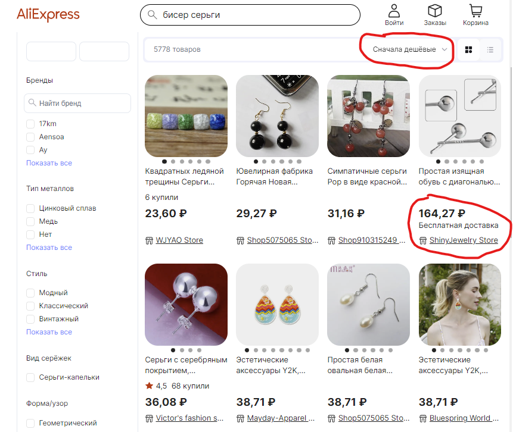

# Баг репорт

**Заголовок:**  Aliexpress | СОРТИРОВКА ТОВАРОВ ПО ВОЗРАСТАНИЮ ЦЕН | Не корректная сортировка цен

**ID:** EX_T-006-01

 **Приоритет:** Средняя

 **Серьезность:** Низкая

**Описание:**

**Окружение:**  

* Браузер: Яндекс v.23.5.3.904 (64-bit)
* OC: Windows 11 Pro 21H2 Сборка 22000.2057

**Шаги по воспроизведению:**

1. Пользователь переходит на страницу <https://aliexpress.ru/wholesale?SearchText=бисер+серьги&g=y&page=1>
2. Пользователь выбирает в фильтре сортировке "Сначала Дешёвые"

**Фактический результат:**

* Попадаются товары с более высокой ценой внутри результатов сортировки

**Ожидаемый результат:**

* Цены товаров отсортированны по возрастанию

Attachment:  

