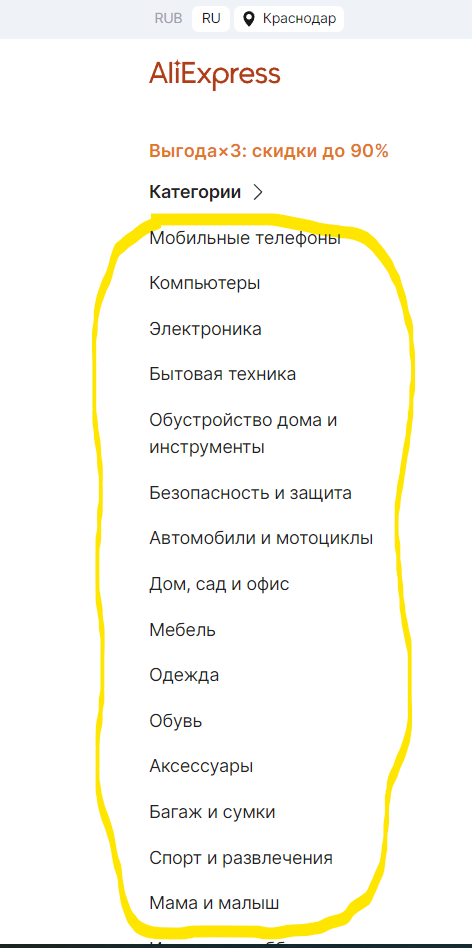

# Исследовательское тестирование

Результаты проведения исследовательского тестирования интернет магазина <https://aliexpress.ru>.

## Тест план исследовательского тестирования

[Ссылка на тест план](https://drive.google.com/file/d/1hGyy46EEzevJ54Pv30X1vLxoXerlwpb2/view?usp=sharing)

---

>### Отчет по исследовательскому тестированию

**Цели тестирования:** оценить продукт и его поведение, получить первое впечатление от продукта, а так же проверить функциональность и выявить ошибки программного обеспечения.

**Окружение:**  

* Браузер: Яндекс  v.23.5.3.904 (64-bit)
* OC: Windows 11 Pro 21H2 Сборка 22000.2057

| ID / Что тестировали         | На что обратили внимание                           | Приложение |
|:-                            |:-                                                  |:-|
| EX_T-001   Header section | **Предложение по улучшению:** Категории товара расположенны не в алфавитном порядке для более удобного поиска по категориям желательно расположить товар в алфавитном порядке иначе приходиться ознакамливаться со всем списком товаров                   |  |

|Записьыыыыыыыыыыыыыыыыыыыыыыыыыыыыыыыыыыыы     Запись|Запись|Запись|

---

>### Итоги исследовательского тестирования

* Было выявлено 15 багов (приложить ссылки)
* составлено 12 предложений по улучшению

