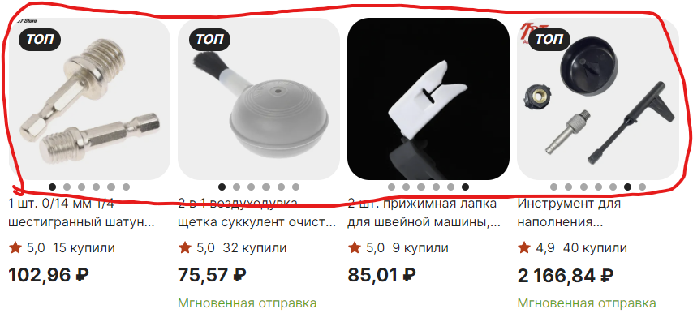

# Исследовательское тестирование

Результаты проведения исследовательского тестирования интернет магазина <https://aliexpress.ru>.

## Тест план исследовательского тестирования

[Ссылка на тест план](https://drive.google.com/file/d/1hGyy46EEzevJ54Pv30X1vLxoXerlwpb2/view?usp=sharing)

---

>### Отчет по исследовательскому тестированию

**Цели тестирования:** оценить продукт и его поведение, получить первое впечатление от продукта, а так же проверить функциональность и выявить ошибки программного обеспечения.

**Окружение:**  

* Браузер: Яндекс  v.23.5.3.904 (64-bit)
* OC: Windows 11 Pro 21H2 Сборка 22000.2057

| ID / Что тестировали           | На что обратили внимание                         | Приложение |
|:-                              |:-                                                |:-|
| EX_T-001   Логотип | Логотип имеет слишком большую область кликабельности. Рис. 1 **Предложение по улучшению:** можно увеличить логотип, чтобы размер область кликабельности соответствовал, а так же это приведет к более лучшей видимости на странице названия магазина. Рис. 1.1 |Рис. 1  Рис. 1.1 
|EX_T-002   Категории товаров | **Предложение по улучшению:** категории товаров могли бы включать в себя подкатегории во всплывающем меню при наведении для более удобного и быстрого поиска, как это реализованно на других сайтах. Рис. 2, Рис. 2.1     **Предложение по улучшению:** категориям товаров можно добавить иконки для более удобного и быстрого поиска. Рис. 2.1 |Рис. 2   Рис. 2.1 |
|EX_T-003   Масштабирование Экрана | **Баг:** при масштабировании окна 767px x 830px карусель статей не возможно прокрутить, а также курсор не меняет свой вид при наведении на эти элементы. Рис. 3   [Ссылка на баг репорт](https://drive.google.com/file/d/1hGyy46EEzevJ54Pv30X1vLxoXerlwpb2/view?usp=sharing)     **Баг:** при масштабировании окна 767px x 830px у всех статей в блоке "div class= SnowStories_SnowStories__stories__1ssch" растянут контент. Рис. 3.1  [Ссылка на баг репорт](https://drive.google.com/file/d/1hGyy46EEzevJ54Pv30X1vLxoXerlwpb2/view?usp=sharing)     **Баг:** при масштабировании окна 767px x 830px карусель категорий товаров не возможно прокрутить. Рис. 3.2   [Ссылка на баг репорт](https://drive.google.com/file/d/1hGyy46EEzevJ54Pv30X1vLxoXerlwpb2/view?usp=sharing)     **Баг:** масштабировании окна 767px x 830px при переходе в  категорию товаров "От 99 р" обрезана картинка и есть наложение иконки входа с классом "option-item-link.profile" на строку поиска. Рис. 3.3   [Ссылка на баг репорт](https://drive.google.com/file/d/1hGyy46EEzevJ54Pv30X1vLxoXerlwpb2/view?usp=sharing)     **Баг:** масштабировании окна 767px x 830px, в каждой категории товаров при переходе в футере нет отступа от границы экрана, иконка "Выгодные цены". Рис. 3.4   [Ссылка на баг репорт](https://drive.google.com/file/d/1hGyy46EEzevJ54Pv30X1vLxoXerlwpb2/view?usp=sharing)      При масштабировании окна 350px x 830px появляется горизонтальный скролл.  Рис. 3.5     При масштабировании окна 766px x 830px карточки товаров перестают перелистываться по наведению курсора. Рис. 3.6   [Ссылка на баг репорт](https://drive.google.com/file/d/1hGyy46EEzevJ54Pv30X1vLxoXerlwpb2/view?usp=sharing)     При масштабировании окна 650px x 830px на некоторых карточках обрезается контент "Мгновенная отправка". Рис. 3.7   [Ссылка на баг репорт](https://drive.google.com/file/d/1hGyy46EEzevJ54Pv30X1vLxoXerlwpb2/view?usp=sharing)|Рис. 3 Рис. 3.1 Рис. 3.2  Рис. 3.3  Рис. 3.4  Рис. 3.5  Рис. 3.6  Рис. 3.7 |
|EX_T-004   Footer | При переходе по ссылкам в футере, а затем при возврате назад не происходит возврат в то же место, что и до перехода. Рис. 4   **Предложение по улучшению:** открывать ссылки в новом окне.     Иконки магазинов загрузки приложений надписи сверху имеют разный регистр. Рис. 4.1    **Предложение по улучшению:** привести надписи к единому образцу или отказаться от надписей сверху и оставить иконки с названием магазинов. | Рис. 4  Рис. 4.1 |
|EX_T-005   Карточки товаров | **Предложение по улучшению:** к карточкам товаров можно добавить кнопку купить или иконку корзины при наведении, чтобы совершать покупки быстрее без перехода на страницу товара, как это реализована в магазине "wildberries" Рис. 5 Рис. 5.1     **Предложение по улучшению:** к карточкам товаров можно добавить кнопку для сравнения товаров, чтобы не приходилось открывать разные окна для сравнения товаров. | Рис. 5  Рис. 5.1 

---

>### Итоги исследовательского тестирования

* Было выявлено 15 багов (приложить ссылки)
* составлено 12 предложений по улучшению
