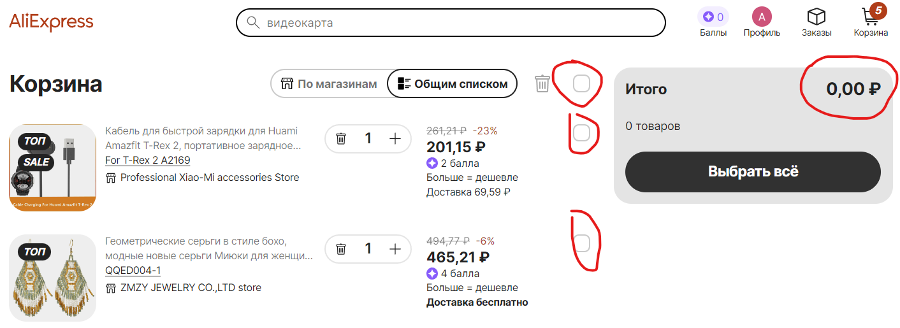

# Исследовательское тестирование

Результаты проведения исследовательского тестирования интернет магазина <https://aliexpress.ru>.

## Тест план исследовательского тестирования

[Ссылка на тест план](https://drive.google.com/file/d/1Vy0f76I7qCiQ_oNLmPmwaO-BOFWufZFh/view?usp=sharing)

---

>### Отчет по исследовательскому тестированию

**Цели тестирования:** оценить продукт и его поведение, получить первое впечатление от продукта, а так же проверить функциональность и выявить ошибки программного обеспечения.

**Окружение:**  

* Браузер: Яндекс  v.23.5.3.904 (64-bit)
* OC: Windows 11 Pro 21H2 Сборка 22000.2057

<table>
<thead>
<tr>
<th style="text-align:left">ID / Что тестировали</th>
<th style="text-align:left">На что обратили внимание</th>
<th style="text-align:left">Приложение</th>
</tr>
</thead>
<tbody>
<tr>
<td style="text-align:left">EX_T-001   Логотип</td>
<td style="text-align:left">Логотип имеет слишком большую область кликабельности. Рис. 1 <strong>Предложение по улучшению:</strong> можно увеличить логотип, чтобы размер область кликабельности соответствовал, а так же это приведет к более лучшей видимости на странице названия магазина. Рис. 1.1</td>
<td style="text-align:left">Рис. 1  Рис. 1.1 </td>
</tr>
<tr>
<td style="text-align:left">EX_T-002   Категории товаров</td>
<td style="text-align:left"><strong>Предложение по улучшению:</strong> категории товаров могли бы включать в себя подкатегории во всплывающем меню при наведении для более удобного и быстрого поиска, как это реализованно на других сайтах. Рис. 2, Рис. 2.1     <strong>Предложение по улучшению:</strong> категориям товаров можно добавить иконки для более удобного и быстрого поиска. Рис. 2.1</td>
<td style="text-align:left">Рис. 2   Рис. 2.1 </td>
</tr>
<tr>
<td style="text-align:left">EX_T-003   Масштабирование Экрана</td>
<td style="text-align:left"><strong>Баг:</strong> при масштабировании окна 767px x 830px карусель статей не возможно прокрутить, а также курсор не меняет свой вид при наведении на эти элементы. Рис. 3   <a href="https://github.com/Andrew-Valiev/andrew-valiev/blob/main/bug_reports/bug_report_EX_T-003-01.md">Ссылка на баг репорт EX_T-003-01</a>     <strong>Баг:</strong> при масштабировании окна 767px x 830px у всех статей в блоке &quot;div class= SnowStories_SnowStories<strong>stories</strong>1ssch&quot; растянут контент. Рис. 3.1  <a href="https://github.com/Andrew-Valiev/andrew-valiev/blob/main/bug_reports/bug_report_EX_T-003-02.md">Ссылка на баг репорт EX_T-003-02</a>     <strong>Баг:</strong> при масштабировании окна 767px x 830px карусель категорий товаров не возможно прокрутить. Рис. 3.2   <a href="https://github.com/Andrew-Valiev/andrew-valiev/blob/main/bug_reports/bug_report_EX_T-003-03.md">Ссылка на баг репорт EX_T-003-03</a>     <strong>Баг:</strong> масштабировании окна 767px x 830px при переходе в  категорию товаров &quot;От 99 р&quot; обрезана картинка и есть наложение иконки входа с классом &quot;option-item-link.profile&quot; на строку поиска. Рис. 3.3   <a href="https://github.com/Andrew-Valiev/andrew-valiev/blob/main/bug_reports/bug_report_EX_T-003-04.md">Ссылка на баг репорт EX_T-003-04</a>     <strong>Баг:</strong> масштабировании окна 767px x 830px в каждой категории товаров при переходе в футере нет отступа от границы экрана иконка &quot;Выгодные цены&quot;. Рис. 3.4   <a href="https://github.com/Andrew-Valiev/andrew-valiev/blob/main/bug_reports/bug_report_EX_T-003-05.md">Ссылка на баг репорт EX_T-003-05</a>      При масштабировании окна 350px x 830px появляется горизонтальный скролл.  Рис. 3.5     При масштабировании окна 766px x 830px карточки товаров перестают перелистываться по наведению курсора. Рис. 3.6   <a href="https://github.com/Andrew-Valiev/andrew-valiev/blob/main/bug_reports/bug_report_EX_T-003-06.md">Ссылка на баг репорт EX_T-003-06</a>     При масштабировании окна 650px x 830px на некоторых карточках обрезается контент &quot;Мгновенная отправка&quot;. Рис. 3.7   <a href="https://github.com/Andrew-Valiev/andrew-valiev/blob/main/bug_reports/bug_report_EX_T-003-07.md">Ссылка на баг репорт EX_T-003-07</a>     <strong>Баг:</strong> при масштабировании окна 766px x 830px происходит наложение контента на поле поиска. Рис. 3.8   <a href="https://github.com/Andrew-Valiev/andrew-valiev/blob/main/bug_reports/bug_report_EX_T-003-08.md">Ссылка на баг репорт EX_T-003-08</a></td>
<td style="text-align:left">Рис. 3 Рис. 3.1 Рис. 3.2  Рис. 3.3  Рис. 3.4  Рис. 3.5  Рис. 3.6  Рис. 3.7  Рис. 3.8 </td>
</tr>
<tr>
<td style="text-align:left">EX_T-004   Footer</td>
<td style="text-align:left">При переходе по ссылкам в футере, а затем при возврате назад не происходит возврат в то же место, что и до перехода. Рис. 4   <strong>Предложение по улучшению:</strong> открывать ссылки в новом окне.     Иконки магазинов загрузки приложений надписи сверху имеют разный регистр. Рис. 4.1    <strong>Предложение по улучшению:</strong> привести надписи к единому образцу или отказаться от надписей сверху и оставить иконки с названием магазинов.</td>
<td style="text-align:left">Рис. 4  Рис. 4.1 </td>
</tr>
<tr>
<td style="text-align:left">EX_T-005   Карточки товаров</td>
<td style="text-align:left"><strong>Предложение по улучшению:</strong> к карточкам товаров можно добавить кнопку купить или иконку корзины при наведении, чтобы совершать покупки быстрее без перехода на страницу товара, как это реализована в магазине &quot;wildberries&quot; Рис. 5 Рис. 5.1     <strong>Предложение по улучшению:</strong> к карточкам товаров можно добавить кнопку для сравнения товаров, чтобы не приходилось открывать разные окна для сравнения товаров.</td>
<td style="text-align:left">Рис. 5    Рис. 5.1 </td>
</tr>
<tr>
<td style="text-align:left">EX_T-006   Поиск</td>
<td style="text-align:left"><strong>Баг:</strong> сортировка товаров по возрастанию цены не корректно сортирует цены попадаются товары с более высокой ценой внутри результатов сортировки. Рис. 6 Тоже самое происходит и с фильтром по диапазону цен. Рис. 6.1    <a href="https://github.com/Andrew-Valiev/andrew-valiev/blob/main/bug_reports/bug_report_EX_T-006-01.md">Ссылка на баг репорт EX_T-006-01</a>     <strong>Баг:</strong> сортировка товаров фильтр &quot;Toп-товары&quot; не корректно сортирует товары попадаются товары и без &quot;Toп&quot; рейтинга Рис. 6.2 Тоже самое относиться и к фильтрам &quot;Бесплатная доставка&quot;, &quot;Мгновенная отправка&quot;, &quot; Высокий рейтинг&quot; присутствуют товары которые не входят в эти группы.    <a href="https://github.com/Andrew-Valiev/andrew-valiev/blob/main/bug_reports/bug_report_EX_T-006-02.md">Ссылка на баг репорт EX_T-006-02</a></td>
<td style="text-align:left">Рис. 6  Рис. 6.1  Рис. 6.2 </td>
</tr>
<tr>
<td style="text-align:left">EX_T-007   Корзина</td>
<td style="text-align:left">В козине с товарами нет отображения общей суммы покупки, пока не будет поставлен чекбокс напротив товара. Рис. 7 <strong>Предложение по улучшению:</strong> убрать чекбоксы из корзины, чтобы видеть сразу общую стоимость товаров. Это повысит удобство использования и избавит пользователей от лишних действий. </td>
<td style="text-align:left">Рис. 7 </td>
</tr>
</tbody>
</table>

---

>### Итоги исследовательского тестирования

* Было выявлено 10 багов.
* Составлено 7 предложений по улучшению.
